# Project Background
The European bank has many branches located in Germany, France, and Spain. The bank wants to understand their customer churn rate and how to solve this growing issue.

The company has immense amount of data on customer's age, tenure, location, number of products, and more that are underutilized. This project will create and analyze data to provide insights that will target demographics most willing to leave and improve the churn rate.

Insights and recommendations provided on following key areas:
- **Demographic Comparisons**: An analysis of a customer's age, region, balance, salary, and credit score.
- **Account Age**: An assessment of how long a customer is with the bank.
- **Satisfaction Sentiment**: An evaulation of customer complaints and satisfaction ratings after complaint resolution.
- **Product Trend Analysis**: An evaluation of patterns between the number of products a customer has from the bank, the card type a customer has, if the customer is an active member, or has a credit card with the bank.

An interactive Tableau dashboard can be downloaded [here](scripts_visualizations/churn_visualizations.twb)

SQL queries regarding answering business questions can be found [here](scripts_visualizations/churn_business_problem.sql)

The Python Pandas script regarding general cleaning and quality checks can be found [here](scripts_visualizations/Bank_Churn.ipynb)

# Data Structure & Initial Checks
The bank's database structure only consisted of one table with a total row acount of 10,000 records

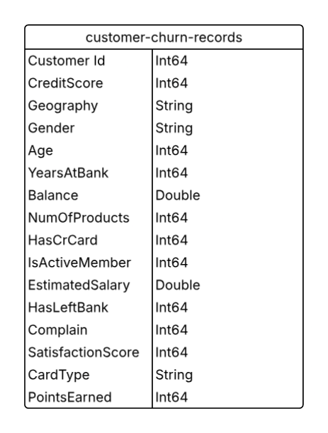

The Python Pandas script regarding general cleaning and quality checks can be found [here](scripts_visualizations/Bank_Churn.ipynb)

# Executive Summary
The findings show that Germany has a 32% churn rate that is nearly the combined churn rate total of the other locations. Demographics further show that females are 52% more likely to leave the bank compared to men. And that customers aged 50 were most likely to leave at 57%.

The first, second, and ninth years showed the highest churn rates at 22%. There was a increase trend with churn rates after 2 products from the bank, a 75% increase between 2 and 3. Platnium and Diamond have the highest churn rate of 20 and 21% respectively. And there suggests a correlation of churn rates between active members of a bank, and if the customer has complained or has a credit card.

An interactive Tableau dashboard can be downloaded [here](scripts_visualizations/churn_visualizations.twb)

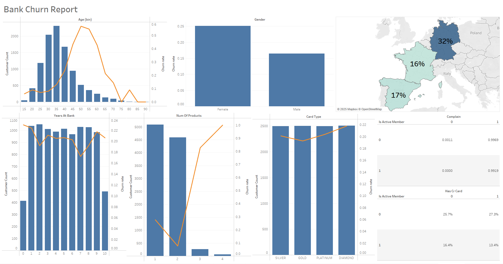

### <ins>Demographic Comparisons</ins>
- Churn rates peaked among male German customers at 55 years old with a 71% churn rate. This is surprising, as older customers are generally less likely to leave the bank compared to younger customers.

- Similarly, female German customers aged 50–55 yielded the highest churn rate at 73%, echoing the previous sentiment.

- On average, customers in Spain had the lowest churn rate among all locations at 19%, which is attributed to the country having the lowest customer density.

- France, on the other hand, has nearly the same number of customers as Germany but a churn rate of 24%, notably lower than Germany’s 34%. This might suggest better bank quality or a more favorable distribution of branches per customer, enabling fuller service.

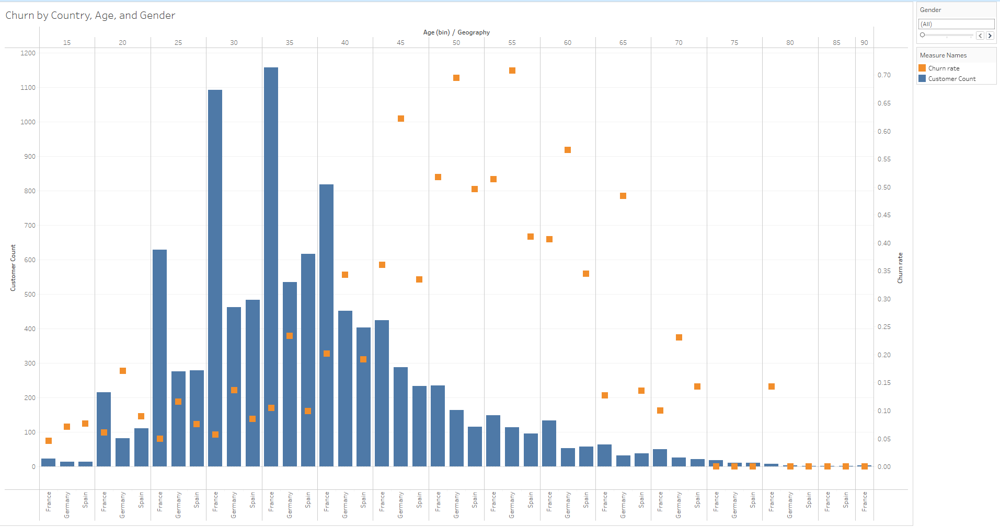

### <ins>Account Age</ins>
- The 0th, 1st, and 9th years of partnership with the bank marked the highest churn rates at 23% and 22%, respectively.

- Churn rates declined year-over-year until customers reached 7 years with the bank, at which point the churn rate was 17%. Rates then increased in the remaining years.

- Over the 10-year span, there is a slight downward trend in churn, from 23% at the beginning to 21% at the 10-year mark. This suggests that the longer a customer stays with the bank, the less likely they are to leave.

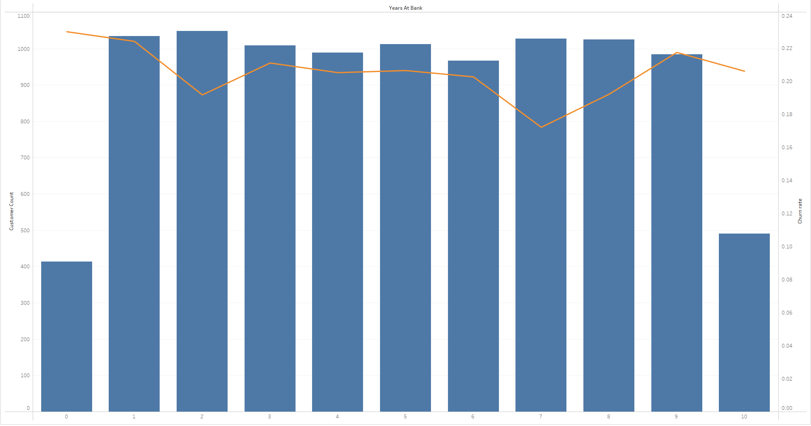

### <ins>Satisfaction Sentiment</ins>
- Churn rates were lowest at a satisfaction score of 3 out of 5. Interestingly, this score also had the highest number of complaints, totaling 2,042.

- Generally, churn rates decrease as satisfaction scores increase. However, the number of complaints remains relatively consistent across scores, suggesting little correlation between complaints and churn based on satisfaction scores alone.

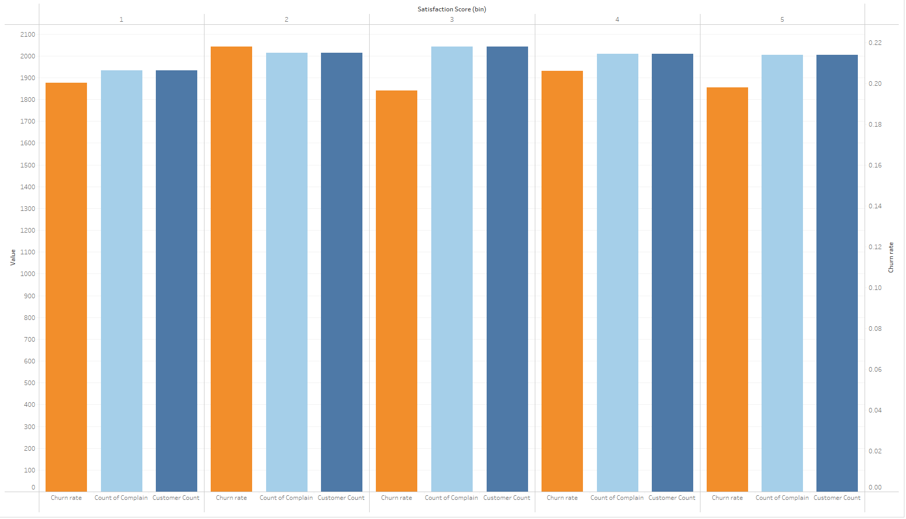

### <ins>Product Trends</ins>
- Comparing customer activity and complaint behavior shows a clear correlation: inactive customers who didn’t complain had a churn rate below 1%, while active customers who did complain had a churn rate of 99%.

- Complaints had a stronger correlation with churn than activity. In both cases where a complaint was made, the churn rate exceeded 99%.

- Customer activity and whether the customer had a credit card also showed a correlation with churn: inactive members without a credit card had a 26% churn rate, while active members with a credit card had only 13%.

- Membership activity had a stronger influence on churn than credit card ownership, with inactive members averaging a 26.5% churn rate compared to 14.9% for active members.

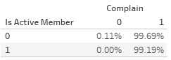 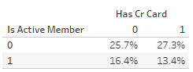

- Customers with less than a $10,000 bank balance had the lowest churn rate at 14%, despite representing the highest customer density. This may indicate limited interaction or experience with the bank, reducing the likelihood of dissatisfaction.

- After a $30,000 balance, churn rates began to increase steadily, peaking at 100% for balances of $230,000. This may suggest diminishing incentives to remain as balances grow.

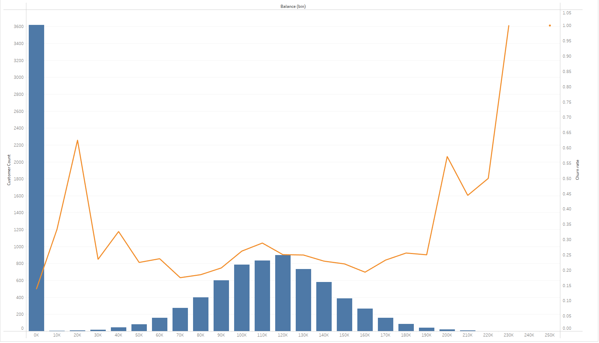

- Churn rate increased with salary, peaking at $170,000 with a churn rate of 23.1%.

- The lowest churn rate was among customers with $120,000 salaries at 19%. Beyond that point, churn began to rise again, with noticeable peaks every $60,000.

- Each peak was followed by a sharp decline and gradual increase, possibly reflecting transitions between salary brackets.

- Overall, there is a modest upward trend of about 2%, supporting the idea that customers with lower balances—and likely lower salaries—are more likely to stay with the bank due to fewer incentives to leave.

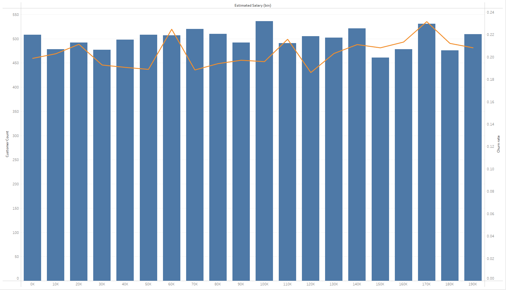

- As previously noted, churn rates were lowest at the 7-year tenure mark. Gold cardholders had the best retention with a churn rate of 15%, followed by Platinum and Diamond cardholders at 15% and 16%, respectively.

- Silver, Diamond, and Gold cards had the highest churn rates during the worst-performing tenure years, at 25%, 22%, and 22%, respectively. This may suggest a lack of incentives tied to these card types.

- Overall, Platinum, Silver, and Gold had the highest churn rates at 22%, 21%, and 20%, respectively. This slight variation (only a 3% difference) suggests a weak correlation between card type and churn.

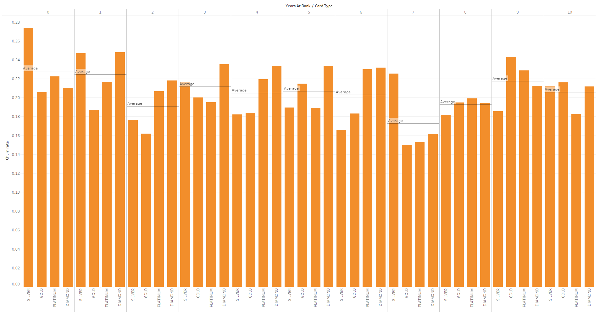 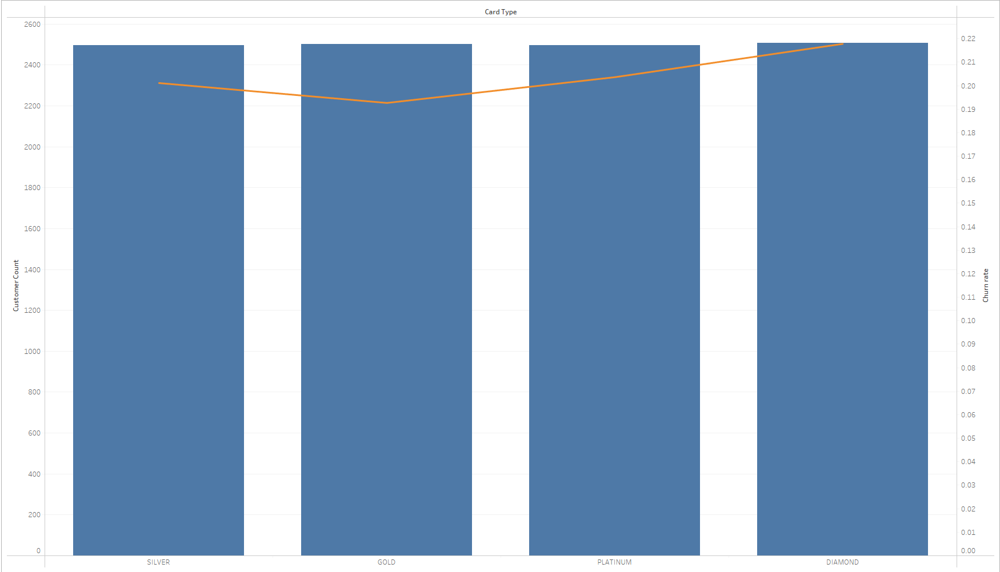

- Customers who owned two products from the bank had the most favorable churn rate at just 7%. Churn rates increased significantly as the number of products increased.

- Due to a difference in sample sizes of over 1,600%, comparing churn rates across product quantities is difficult, and correlations should be viewed cautiously.

- The decrease in churn between owning one and two products—accompanied by a difference of about 500 customers and a 20% drop in churn—suggests that owning more products may improve retention.

 

- Looking at broader patterns, customers who owned two products were, on average, 38 years old, had $52,000 in the bank, and earned $100,000. This demographic suggests that younger customers with lower income and balances are less likely to leave the bank.

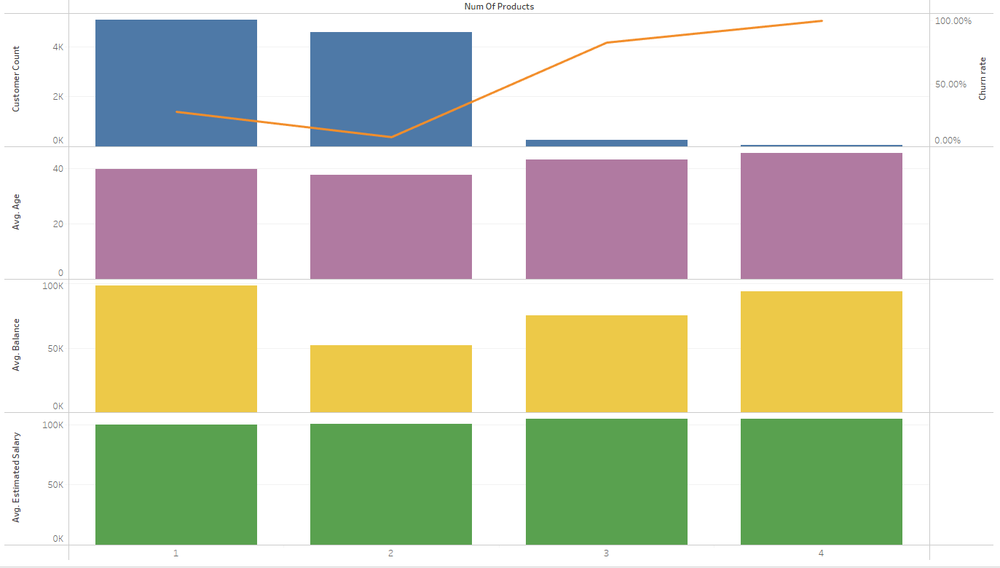

- Churn rates peaked at a credit score of 350 with 100%, then sharply dropped to 25% at a score of 450, and further decreased to 18.5% at a score of 850. This suggests a notable correlation between higher credit scores and lower churn.

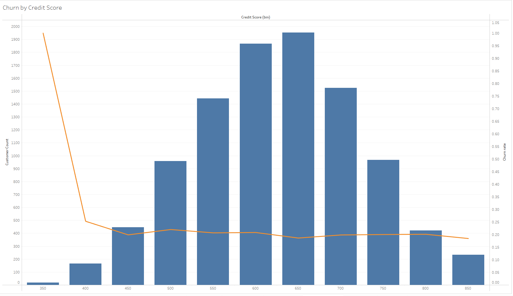

### <ins>Recommendations</ins>
- 