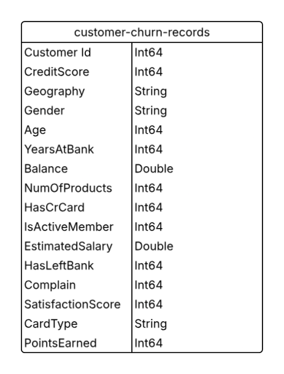
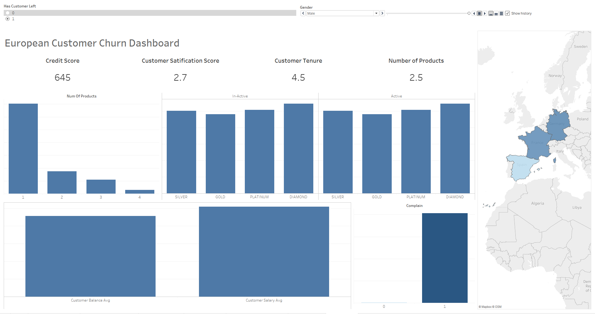
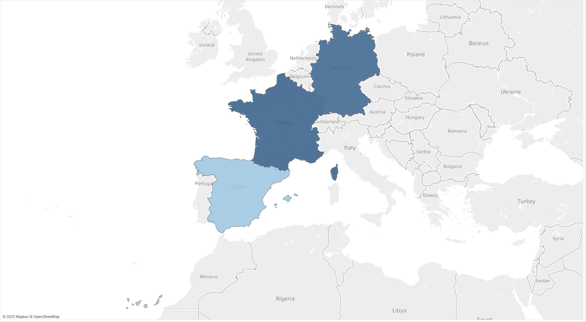

# Project Background
A bank with many branches located in Germany, France, and Spain wants to understand their customer churn rate and how to solve this growing issue.

The company has immense amount of data on customer's age, tenure, location, number of products, and more that are underutilized. This project will create and analyze data to provide insights that will target demographics most willing to leave and improve the churn rate.

Insights and recommendataiona re provided on following key areas:

- **Satification Sentiment**: An evaluation of satification scores and determining if the customer previously complained that resulting in their departure.
- **Regional Comparisons**: An assessment of customer dissatisfaction based on location.
- **Product Trend Analysis**: Evaulation of various card types offered, how many products the customer bought from the bank, the balance and salary averages, credit scores, active member status, and if they opened a credit card under the bank.

An interactive Tableau dashboard can be downloaded [here](churn_visualizations.twb)

SQL queries regarding answering business questions can be found [here](churn_business_problem.sql)

The Python Pandas script regarding general cleaning and quality checks can be found [here](Bank_Churn.ipynb)

# Data Structure & Initial Checks
The bank's database structure only consisted of one table with a total row acount of 10,000 records

The Python Pandas script regarding general cleaning and quality checks can be found [here](Bank_Churn.ipynb)

# Executive Summary
From the key performance indicators showed that an overwhelmingly 99.8% of customers who decided to leave the bank complained with a overall satification score of 54%. Customers generally owned two products for around four years before leaving the bank. Ultimately, many of these factors can be attributed to various reasons such as lifestyle, the following sections will explore other factors and highlight areas to imrpove on.

Below is a Tableau dashboard and more examples are included through the report. The interactive Tableau dashboard can be downloaded [here](churn_visualizations.twb)

### Regional Comparisons:

- 

Female Density            |  Male Density
:-------------------------:|:-------------------------:
  |  
